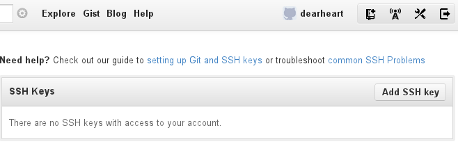
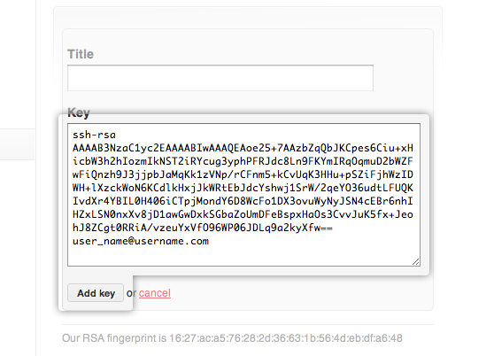
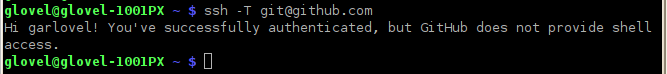

.. _instructions:

#############################
 Repository Exercise
#############################

This exercise requires using a web browser, a text editor, and a console window
for the system command prompt. As with modern open source software development 
practices, commands use (U/L)inux syntax. Open windows on the local desktop for 
the web browser, console, and editor before starting.

Part 1. Local Setup Commands
=============================

.. Note::

  Use your command line, console, or terminal to enter commands in this section. 

Create a Project Folder
-----------------------------

To create a projects folder, at a terminal prompt type the following commands::

  mkdir -p ~/Projects
  cd ~/Projects

Generate Missing SSH Keys
-----------------------------

Type the following command to generate **ssh keys** for a user, if missing::

  if [ ! -f ~/.ssh/id_rsa ]; then ssh-keygen -N '' -f ~/.ssh/id_rsa; fi

Copy SSH Key to Clipboard
-----------------------------

Choose a command from the following list to copy your SSH key to the clipboard:

+---------------------------+-------------------------------------------------+
| Operating System          | Command                                         |
+===========================+=================================================+
| KUbuntu Linux             | ``cat ~/.ssh/id_rsa.pub | xclip``               |
+---------------------------+-------------------------------------------------+
| Mac OS-X                  | ``cat ~/.ssh/id_rsa.pub | pbcopy``              |
+---------------------------+-------------------------------------------------+
| Cygwin                    | ``cat ~/.ssh/id_rsa.pub | putclip``             |
+---------------------------+-------------------------------------------------+

Part 2. Configure GitHub Account 
================================

.. Note::

  Use your web browser (Chrome, Firefox, or Safari) to access web services.

Login to GitHub
-----------------------------

In the web browser, go to GitHub: https://github.com/login. Enter your 
**Username** and **Password**, then click :guilabel:`Sign In`.

Add SSH Key on Github
-----------------------------

+ Click the wrench to the right of your name, :guilabel:`Account Settings`,
+ Then select :guilabel:`SSH Keys` from the settings menu on the left.
+ On the **SSH Keys** bar, click the :guilabel:`Add SSH key` button.

+ Click in :guilabel:`Key`, and press :kbd:`<Ctrl-V>`.
+ Click in :guilabel:`Title`, and enter the workstation@username and date.
+ Click the button :guilabel:`Add key` to finish.

Verify ssh with login
-----------------------------

+ Back to the console, enter command:

  ::

    ssh -T git@github.com

+ At the "Are you sure ... (yes/no)?" question, type :kbd:`yes`, press :kbd:`<Enter>`.
+ You should get a response that you have successfully authenticated:

Part 3. Fork GitHub Repository
==============================

.. Note::

  Use your web browser (Chrome, Firefox, or Safari) to access web services.

There is no need to start from scratch when creating a documentation project. 
Instead, clone or fork someone else's open source work. With your GitHub 
account, 

+ visit `the AAltsys GitHub page <https://github.com/aaltsys/sample-collaborate>`_ 
+ find the :kbd:`sample-collaborate` repository and click the name,
+ then click the :guilabel:`fork` button at the top right of the page.

GitHub will make a copy of the `sample-collaborate` repository for you, and 
then switch to view your copy.

Part 4. Make Local Clone
=============================

.. Note::

  Use your command line, console, or terminal to enter commands in this section. 

Once you own a repository on GitHub, you will want to clone it. The GitHub 
repository is remote, and cloning makes a local copy which you can edit. 
Here is the console command::

  git clone (link_to_your_project) ~/Projects/sample-collaborate

There are two parameters to the :command:`git clone` command. First is your 
project name, which is the text following "Git Read-Only" in the image below. 
(But copy the text from your fork of the repository please, so it will have 
your name instead of mine.) The second parameter is the folder name to create 
for the project.

.. image:: _images/05_publish_clone.png

Part 5. Edit Local Readme
=============================

.. Note::

  Use the file manager, the editor, and the web browser in this section. 

From your file mamanger, right-click on file :file:`~/Projects/readme.md` 
and open it with your system editor. (Possible editors are listed below.)

+---------------------------+-------------------------------------------------+
| Operating System          | Command                                         |
+===========================+=================================================+
| KUbuntu Linux             | From file manager, open with Kate               |
+---------------------------+-------------------------------------------------+
| Mac OS-X                  | From Finder, open with TextEdit                 |
+---------------------------+-------------------------------------------------+
| Cygwin                    | From Computer, open with Notepad                |
+---------------------------+-------------------------------------------------+

Add Your Name
-----------------------------

#. On the top line, replace ``Your Name Here`` with your actual name, or the 
   names of your team members
#. Press :kbd:`<Ctrl-A>, <Ctrl-C>` to copy the markup text to your clipboard. 

Test changes in Slekx
-----------------------------

#. In the web browser, open http://old-wp.slekx.com/the-markdown-tutorial/
#. Click in the text of the left pane in the Slex editor
#. Press :kbd:`<Ctrl-A>, <Ctrl-V>` to paste your markup document
#. View your changes in the Interactive editor right pane
#. Edit the left-side text for corrections, view the right results
#. When satisfied, press :kbd:`<Ctrl-A>, <Ctrl-C>` to copy the text.

Paste back to editor 
-----------------------------

#. Click back in the edit text of the local editor on your desktop
#. Press :kbd:`<Ctrl-A>, <Ctrl-V>` to paste your markup text back
#. Press :kbd:`<Ctrl-S>` or click on the :guilabel:`Save` button to save your 
   document.

Part 6. Commit and Push
=============================

.. Note::

  Use your command line, console, or terminal to enter commands in this section. 

Commit Changes
-----------------------------

At the command line, enter the following statements::

  git add .
  git status
  git commit -m "Added my name to readme"

Push to GitHub
-----------------------------

Push your local repository changes to your remote repository on GitHub::

  git push

Part 7. Send a Pull Request
=============================

.. Note::

  Use your web browser (Chrome, Firefox, or Safari) to access web services.

View remote project changes
-----------------------------

Refresh your GitHub project page in the web browser to display the new 
:file:`readme.md` in your project.

Submit a pull request
-----------------------------

To the right of the project title, click the :guilabel:`Pull Request` button.

On the resulting page, enter a title and a request message, using Markdown 
syntax if desired. Click the :guilabel:`Send pull request` button to complete 
the request, as shown in the image below: 

