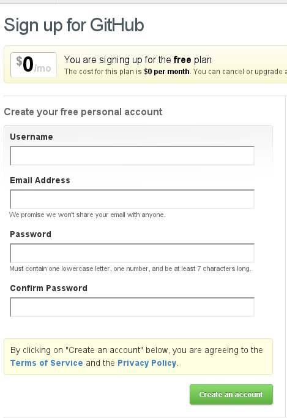
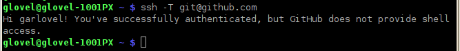
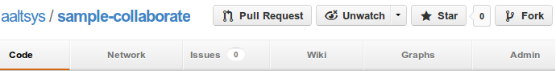

.. _hosting:

#############################
 GitHub Repository Hosting
############################# 

There are many options for free repository storage and hosting, one is enough. 
This guide recommends GitHub for its excellent documentation and good feature 
set. [#]_

Register a GitHub Account
=============================

If you lack a GitHub account, here are instructions.

Register for free:
-----------------------------

+ Click this link to `the GitHub signup page <https://github.com/signup/free>`_. 
+ Enter your information (four fields).
+ Click on :guilabel:`Create an account`.

Copy SSH Key to Clipboard
-----------------------------

.. note:: 

   Each combination of user and workstation requires a different ssh key.
   Use the following command will generate missing **ssh keys** for a user::
   
     if [ ! -f ~/.ssh/id_rsa ]; then ssh-keygen -N '' -f ~/.ssh/id_rsa; fi

Copy your SSH key to the clipboard with the console command::

   cat ~/.ssh/id_rsa.pub | xclip              |

Add SSH Key on Github
-----------------------------

+ Click the wrench to the right of your name, :guilabel:`Account Settings`,
+ Then select :guilabel:`SSH Keys` from the settings menu on the left.
+ On the **SSH Keys** bar, click the :guilabel:`Add SSH key` button.

.. image:: _images/05_publish_account.png

+ Click in :guilabel:`Key`, and press :kbd:`<Ctrl-V>`.
+ Click in :guilabel:`Title`, and enter the workstation@username and date.
+ Click the button :guilabel:`Add key` to finish.

.. image:: _images/05_publish_ssh.png

Verify ssh with login
-----------------------------

+ Back to the console, enter :command:`ssh -T git@github.com`.
+ At the "Are you sure ... (yes/no)?" question, type :kbd:`yes`, press :kbd:`<Enter>`.
+ You should get a response that you have successfully authenticated:

Fork a Remote Project
=============================

There is no need to start from scratch when creating a documentation project. 
Instead, clone or fork someone else's open source work. With your GitHub 
account, 

+ visit the `AAltsys GitHub page <https://github.com/aaltsys>`_ 
+ find the :kbd:`doc-publish` repository and click the name,
+ then click the :guilabel:`fork` button at the top right of the page.

GitHub will make a copy of the repository for you, and then switch to view your 
copy.

Clone a Remote Project
=============================

Once you own a repository on GitHub, you will want to clone it. The GitHub 
repository is remote, and cloning makes a local copy which you can edit. 
Here is the console command::

  git clone (link_to_your_project) ~/Projects/doc-publish

There are two parameters to the :command:`git clone` command. First is your 
project name, which is the text following "Git Read-Only" in the image below. 
(But copy the text from your fork of the repository please, so it will have 
your name instead of "AAltsys.") The second parameter is the folder name to create 
for the project.

.. image:: _images/05_publish_clone.png

Pushing to GitHub
=============================

You may have noticed: **doc-publish** contains a repository from GitHub. 
Committed changes in the doc-publish folder are updated to GitHub with the 
command::

  git push 

------

.. rubric:: Footnotes

.. [#] Wikipedia shows a comparison of options for free repository hosting at  http://en.wikipedia.org/wiki/Comparison_of_open_source_software_hosting_facilities. 
