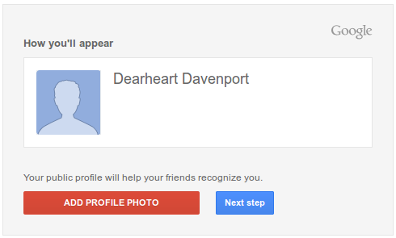

.. _setup_gmail:

#############################
 Create Gmail Account
#############################

Cloud development may be performed on any computer with an effective web 
browser. This means that development may be performed on public access computers 
in school classrooms, libraries, coffee shops, or other locations. To guarantee 
privacy and security for the developer, it is necessary to have a separate 
identity for development, particularly with separate email.

The first step in cloud development is to create this new web identity, starting 
with email. Google's Gmail is an excellent web-based email service which is 
available free for individual accounts. Use the following instructions to sign 
up for a Google account and Gmail.

Get a Google  Account
=============================

.. warning:: An account application with a birth year of 1999 or later will be 
   rejected. Even worse, when using Google's Chrome browser, you will have to 
   switch to a different browser such as Firefox to enter an application once a 
   rejection occurs. 
   
.. sidebar:: GMail Signup

   .. image:: _images/01_gmail-1.png

In your web browser, right-click the following link and open it in a new tab:

| https://accounts.google.com/SignUpWidget

Then fill out the **GMail Signup** form as follows:

+------------------------+-------------------------------+
| **Name**               | Actual first name, Last name  |
+------------------------+-------------------------------+
| **Your username**      | alt.Firstname.Lastname        |
+------------------------+-------------------------------+
| **Create password**    | 8 or more letters or numbers  |
+------------------------+-------------------------------+
| **Confirm password**   | Retype your password          |
+------------------------+-------------------------------+
| **Birthday**           | Your birth date, year < 1999  |
+------------------------+-------------------------------+
| **Gender**             | Make a selection              |
+------------------------+-------------------------------+
| **Mobile phone**       | Enter this if you want to     |
+------------------------+-------------------------------+
| **Old email address**  | Required for notifications    |
+------------------------+-------------------------------+
| **Are you a robot?**   | type word <space> word        |
+------------------------+-------------------------------+
| **Location**           | United States                 |
+------------------------+-------------------------------+
| **Agree to terms ...** | Check this box                |
+------------------------+-------------------------------+

Click button :guilabel:`Next step` to complete the form. You will see your 
profile page display. Again, click button :guilabel:`Next step` to continue. 
A welcome page will display, showing that your new account is ready. 

Click :guilabel:`Next step` one last time to view the final account setup page.
Now go to your new Gmail account. Right-click the link https://mail.google.com 
and choose  :menuselection:`Open in new tab`. 

.. note:: You will receive an email at your current email address with a 
   verification code. You may wish to print out that email, and forward the 
   email to your new mailbox. An example verification email is shown following: 
 
   .. image:: _images/01_gmail-3.png 
