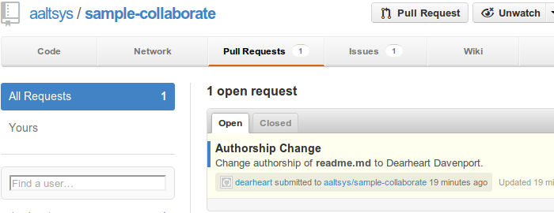

.. _summary:

#############################
 Collaboration Summary
#############################

Pull Request
=============================

Once a developer has issued a pull request to a project, the project manager 
will see the request on the main project page, as shown below. The manager 
can then accept the request and merge it into the master project. 

Developer Tools
=============================

Developers use four common system tools to do most of their work:

+ A **text editor** for writing programs and documents
+ A **file system browser** which displays local file information 
+ A **web browser** for viewing output documents locally and on the Internet 
+ A **console** where system commands and batch files are executed

System Utilities
=============================

Behind the scenes, the computer operating system must have a series of standard 
utilities which provide functionality for system commands. Some of these are:

+ A **repository** for document versioning and collaboration
+ **Language compilers** and **script interpreters** to make output
+ **ssh** for secure shell command execution across the Internet

Internet Services
=============================

Internet services extend the capabilities of the local computer or the local 
network to encompass the entire planet. A **git** repository installed on a
developer's workstation, and the same software hosted on the Internet, permits 
collaborative software development with teams all over the world.

Other Site Content
=============================

Browse through the other pages of this site to learn about git, GitHub, 
MarkDown, and the usual developer workflow.

External Resources
=============================

This website is written in Sphinxdoc, an extension of ReStructured Text, and
GitHub hosts this site for free. Source text of each page may be viewed by 
clicking the :guilabel:`View Source` in the side menu of any page. The source 
repository for the site is on GitHub as well. [#]_

Learning ReST markup and writing a documentation website hosted for free at 
GitHub is not difficult. A guide to installing Linux and SphinxDoc tools for 
writing documentation is available at 
`publish.aaltsys.com <http://publish.aaltsys.com/00_background.html>`_. The 
source repository for that site is also hosted at GitHub. [#]_

------

.. rubric:: Footnotes

.. [#] Collaboration project source: https://github.com/aaltsys/doc-collaborate. 

.. [#] Publication project source: https://github.com/aaltsys/doc-publish.
