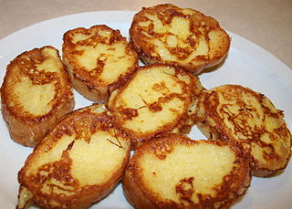

.. _markdown:

#############################
 Markdown Syntax
#############################

Headings
=============================

Each document section is indicated with either a hash heading (#) or underlines::

  # An H1 Heading Goes Here, or #
  
  H1 Headings are Underlined
  ==========================

An H1 Heading Goes Here, or
=============================

H1 Headings are Underlined
=============================

Subsections use hyphen underlining, or (##) heading::

  ## This is a sub-heading ##
 
  And this is also a sub-heading
  ------------------------------

This is a sub-heading
-----------------------------

And this is also a sub-heading
------------------------------

Hash marks can indicate additional levels of sub-sub- headings, up to six::

  ###### This is a H6 sub-heading ######

Break lines are inserted with three or more hyphens, asterisks, or underscores::

  ___
  - - -
  *******

-------------

Inline Style Formatting
=============================

The following table displays inline or embedded markups for text styles:

+---------------------------+-------------------------------+
| Markup                    | Result                        |
+===========================+===============================+
| \*emphasized text\*       | `emphasized text`             |
+---------------------------+-------------------------------+
| \_emphasized text\_       | `emphasized text`             |
+---------------------------+-------------------------------+
| \*\*bold text\*\*         | **bold text**                 |
+---------------------------+-------------------------------+
| \_\_bold text\_\_         | **bold text**                 |
+---------------------------+-------------------------------+
| \`\`unformatted text\`\`  | ``unformatted text``          |
+---------------------------+-------------------------------+

Paragraphs
=============================

Paragraphs are indicated by entering two newlines, which shows as a blank line 
in the text. Spaces and single newlines are ignored except in lists or quotes.

Code blocks are set off by indenting 4 or more spaces, or 1 tab::

  |    This will be a code block or command
  |    This is another line in the code block

::

  This will be a code block or command
  This is another line in the code block

List Entries
=============================

Use hyphens, asterisks, or plusses to create bulleted (unordered) lists::

| * This is a list with an embedded list
| + + Here is an embedded line
| + + This is the second embedded line
| * This is the second main line of the list

- This is a list with an embedded list
-  + Here is an embedded line
-  + This is the second embedded line
- This is the second main line of the list

Any numbered lines with periods will form an ordered list::

  1. Use number 1. on the first line of the list.
  5. Follow the first line with additional numbered lines.
  3. The order of the lines matters, but the number sequence is irrelevant.

#. Use number 1. on the first line of the list.
#. Follow the first line with additional numbered lines.
#. The order of the lines matters, but the number sequence is irrelevant.

List items may include paragraphs provided hanging indents are used for the 
first line of each paragraph.

Tables
=============================

Markdown syntax does not include a specification for tables.

Link Directives
=============================

Web Hyperlinks
-----------------------------

Markdown supports two styles for links: inline and reference. With either 
style, use square brackets surrounding the name text you want to display.

Inline-style links use parentheses immediately after the link text. For example::

  This is an [example link](http://example.com/).

This is an `example link <http://example.com/>`_

Reference-style links allow you to refer to your links by names, which you 
define elsewhere in your document::

  I get 10 times more traffic from [Google][1] than from 
  [Yahoo][2] or [MSN][3]. 
  
  [1]: http://google.com/        "Google"
  [2]: http://search.yahoo.com/  "Yahoo Search"
  [3]: http://search.msn.com/    "MSN Search"

I get 10 times more traffic from `Google <http://google.com/>`_ than from 
`Yahoo Search <http://search.yahoo.com/>`_ or `MSN Search <http://search.msn.com/>`_.

Local Filesystem Links
-----------------------------

To refer to a relative path on the local system or server, replace the 
protocol "http://" with a simple slash "/" in the preceding link format::

  See my [About](/about/) page for details.

See my `about </about/>`_ page for details.

Images
-----------------------------

Image syntax is very much like link syntax, with both inline and reference 
forms::

  
  
  ![alt text][id]
  [id]: /_images/00_testimg.jpg "Title"

Both of the above examples produce the same output:

------

.. rubric:: Footnotes

.. [#] http://github.github.com/github-flavored-markdown/sample_content.html

.. [#] http://daringfireball.net/projects/markdown/syntax